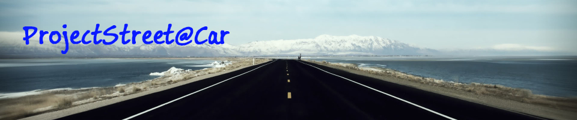

The ProjectStreet@Car server
=========================

The [ProjectStreet@Car](http://projectstreet.nordgedanken.de) server is a multi-container [Docker](http://www.docker.com) application. In a few commands anyone can check out the code from here and have a local version of the server running (identical to the real thing in every way except for user data and a few private files). 

The requirements for running the server are:
* [docker](http://docs.docker.com/engine/installation/)
* [docker-compose](https://docs.docker.com/compose/install/)
* [make](https://www.gnu.org/software/make/)

To download, build, and start the server on a fresh environment:

```bash
git clone --recursive https://github.com/Nordgedanken/ProjectStreet.git
cd ProjectStreet
make up
```

*Note: the first time you run this it may take a while as many dependencies are downloaded and images are built from scratch.*

At this point, you should be able to connect your browser to [localhost](http://localhost:80) to see the server webpage. To connect a BOINC client to the server, you need to reroute [projectstreet.nordgedanken.de](http://projectstreet.nordgedanken.de) to [localhost](http://localhost:80) (b/c the server code has its URL hardcoded). On Linux, this can be done by adding the line `127.0.0.1projectstreet.nordgedanken.de` to your `/etc/hosts` file. Then connect BOINC to [projectstreet.nordgedanken.de](http://projectstreet.nordgedanken.de) as usual. 

For more detailed documentation on how the server works, see the [Design Overview](docs/overview.md).
